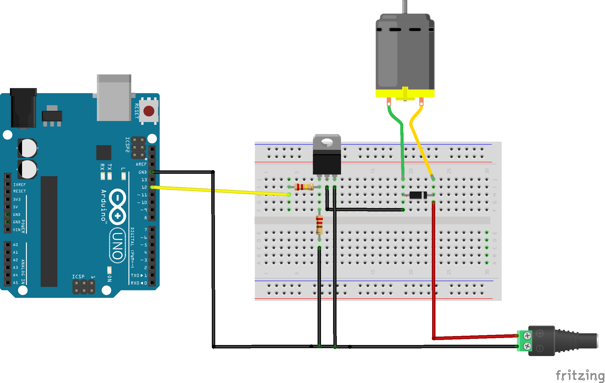

# Vibration motors

Vibration motors use a shaft and bearing to create vibrations. It runs on direct current and has a rating of 5V. The two terminals allow it to be used like a DC motor.

----
### HARDWARE

- vibration motor

- IRLZ44N MOSFET

- 220Ω resistors x2

- IN4148 zener diode

- 5V Power supply with socket and wire connectors

- medium breadboard

- Jump leads

----
### WIRING



----
### Code and explanation

```

void setup() {
  // put your setup code here, to run once:
pinMode(12,OUTPUT);
}

void loop() {
  // put your main code here, to run repeatedly:
digitalWrite(12,HIGH);
delay(1000);
digitalWrite(12,LOW);
delay(1000);
}

```
Copy and paste the code above or download the sketch [here](https://github.com/kingston-hackSpace/Motors/blob/main/vibration_motor.ino).

The sketch is a variation of the blink sketch. By changing the digital pin to HIGH, the MOSFET completes the circuit with power supply and the vibration motor, providing power and making it spin. You can make variations in the loop pattern to vary how the motor is on or off.

----

### Notes

-  Ensure the diode is placed the correct way around in the circuit (The silver band should be facing towards the positive terminal of the power supply.
-  Make sure the power supply is set to 5V. You can use the key that comes with it to turn the dial near the plug pins.

